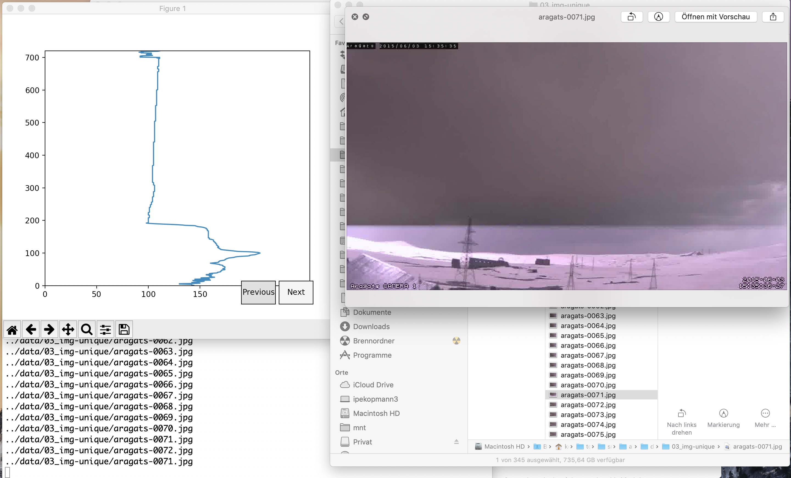

# Aragats lightning studies

At the Aragats Cosmic Ray Research Station the weather is monitored with visible light cameras in addition to a variety of cosmic ray detectors. The information of both types of detectors should be correlated.

In order to store only images with lightning it is necessary to implement a robust filter that detects lightning and only stores these images. 

Another idea is to use machine learning algorithms to detect image with lightning. A rough location of the events and characterization is desired. 

Categories:

- no lightning
- lightning - cloud to ground
- lightning - cloud to cloud
- lightning bursts in cloud

Is it possible to detect direction and distance of the strikes?


## Contents


- [Overview analysis results](data/README.md)

- [Extract timestamps](src/timestamps/README.md)


File structure:

```
data/		raw data (movie), single images and analysis results
info/		related external information 
src	/		Python scripts to extract timestamps and
			analyze the images
src/exposure.py Graphical script to inspect the integral greyvalues of a line
rishabh/	Internship report and presentation
zapf/		Zapf data
```

### Exposure.py

Calculate the integral exposure of all lines in a image. Display the vertial exposure profile. Two buttons `previous` and `next` enable a frame-by-frame navigation through the image stack.

In the example the illumination of the lightning in frame 71 is clearly visible. It is caused by the rolling shutter in the camera.




## Algorithms

### Dynamic background detection

The background substraction works estonishing well. With the manually selected rteference images with very high precision the light deposition in the frames can be detected. In order to use the background detetion it is necessary to dynamically update the background images.

Algorithm:

- the first image is a background image. 
  this image is very likely background. 
- read the next image, substract both. If there are only very small changes, update the new image, if the new image is much darker it also is the new background.
- The differnce image normally has only light deposition in a few lines. These ones are caused by the lightning. 


## Previous work

Internship Rishabh 2018. He has prepared a train dataset and applied deep learning. 

Documentation: 

- [Presentation](rishabh/KIT_Presentation_V3.pdf)
- [Internship report](rishabh/Rishabh_Thukral_full_report.pdf)

Michael Zapf has performed analysis of the movie with Matlab. 


