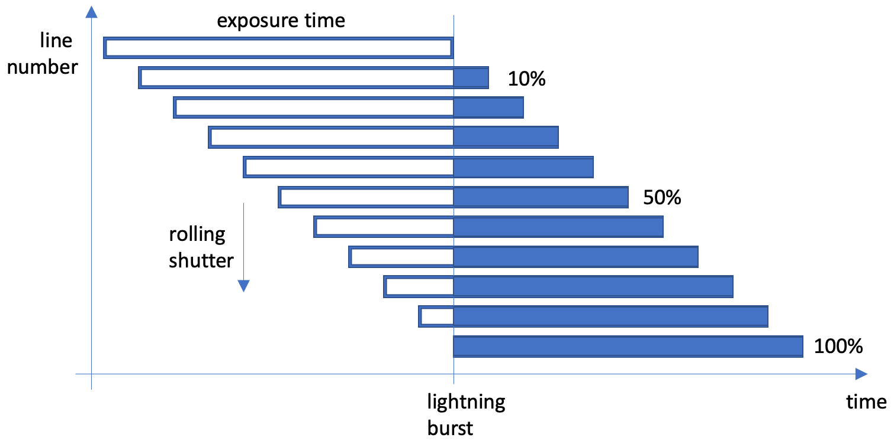
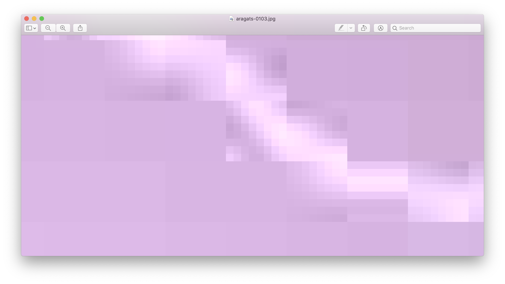

# Aragats lightning study

At the Aragats Cosmic Ray Research Station the weather is monitored with visible light cameras in addition to a variety of cosmic ray detectors. The information of both types of detectors should be correlated.

## Lightning data

- Original data as movie: aragats-lightning-hour15-camera1.mp4
- Frame size: 1280 x 720 
- Codec: H.264
- Duration: 2:52 = 172 seconds 
- First frame: 2015-06-03 15:17:19 - 29
- Last frame: 2015-06-03 15:46:21 - 24
- Real time: 29:02 minutes = 1742 seconds

The movie has been assembled from several shorter sequences.

In the lower right corner is date, time and frame number of the exposure given. The frame number run from 0 to 29.


### Rolling shutter

The camera was using a so-called rolling shutter. This means the full frame is not recorded at once, but the shutter is moving line by line over the images from top to bottom. If now lightning start during recording of the image, from a certain line on the lighning is visible. All lines already recored stay dark, while the new lines will be significantly brighter. Thus the line information increases the time resolution by a factor of 720.

After the lightning the images return to a similar background level as before. An automatic adjustment of the exposure time can not be detected.

In case of lightning burst the images immediately bright, but due to the rolling shutter the intensity of the lines only increases linearly over about 8 to 10 lines as these lines are exposed slightly shifted at the same time. The informatrion of previous lines is already recorded. All further line will see the burst.




### Adaptive JPEG image encoding

Depending on the image content 8 x 8 pixel blocks often have the same value. Only if the values change much individual pixel values are used with in these blocks. The block are always regularly spaced. They start at pixel (0, 0) and are then spaced every 8 pixel in x and y direction.

Example of the adaptive encoding: The region around the lightning strike used all the 64 pixel while the surrounding area is only represented by a single value per block.




## Processing

### Extraction of single frames

Extraction of frames from the movie:

``` 
ffmpeg -i aragats-lightning-hour15-camera1.mp4 tmp/aragats-%04d.jpg
```

The command results in  5161 images. This is equivalent to the length of 172 seconds multiplied by a framerate 
of 30 fps.

BUT there are only 2 different images every second. 15 images are identical.

```
ffmpeg -i aragats-lightning-hour15-camera1.mp4 -r 15 tmp/aragats-%04d.jpg
```

Result: The build-in subsampling only procudes a nearly correct result: 347 image, where the first three are still identical and the last image of the movie is missing.
The build-in subsampling only procudes a nearly correct result. 

```
ffmpeg -i aragats-lightning-hour15-camera1.mp4 -vf "select=not(mod(n\,15))" -vsync vfr tmp2/aragats-%04d.jpg
```

The video filter option returns the desired result. All different images are available. In total: 345 images.


### Read timestamp

The script `ocr_simple.py` extracts the timestamp information from the images. The simple algorithm uses pattern matching on the fixed timestamp locations in the images. 

Copy and adjust the initial configuration file:

```
cd data
cp ../src/timestamps/config_sample.json

```

Extract the timestamp information

```
ipekopmann3:data kopmann$ python ../src/timestamps/ocr_simple.py 03_img.json
Proccessed images in dataset:  345
Total number of sequences   :  33

```

The script will automatically also identify the sequences combined in the dataset. A value of 100 frames equivalent to about 3 sec has been found to be a rather sensible limit. The first image is automatically selected as reference image. It has to be checked manually, if this should be used for brackground substraction.

Sequence parameters: 

```
{
    "id": 1
    "images": [1,2,3,4,5,6,7,8], 
    "skip": 0, 
    "ref": 1, 
}
```


### Background substraction

The background light level is slightly variing during the observation time. Therefore each sequence has to be trated independantly. One image of the sequence without lightning has to be defined as reference frame. This image will be used to eliminate the background. The substraction works very well, if a background image with identical cloud structure is selected. In most sequences this is possible. Where a background image from another sequence has to be used the discrimination is significantly worse - but still useful.

The script `bg-removal.py` reads the dataset configuration file and generates a new stack of images without background. The subraction can be done with the original colored images or only the brightness values. The result should be inverted. Dimm signals can be better detected with white background.

```
cd data
python ../src/bg-removal.py 04_img-light3

```
 
### Horizontal edge detection 

Lighting bursts are extremely fast. While recording the images from one line to the next one changes from complete darkness to bright light happen. Due to the rolling shutter a linear increase and decrease of the light level can be observed. The number of overlapping lines is in the order of 8 to 10. Thus typical image filter kernels with 3 x 3 or 5 x 5 pixel are not matching to this features. Considering also the adaptive image encoding it is necessary to reduce the size of the images before applying edge filters.

The script `resize.py` transforms the image stack from the original size of 1280 x 720 pixel to 160 x 90 pixel. Each block of 8 x 8 pixel so represents exactly one pixel in the transformed image. 

```
cd data
python ../src/resize.py 
```

The script `edges.py` can now apply a horzontal 3 x 3 edge filter with the kernel 

```
 1    1    1
 0    0    0
-1   -1   -1 
```

as alternative also a 5 x 5 wider version might be considered.

```
 0    0    0    0    0
 1    1    1    1    1
 0    0    0    0    0
-1   -1   -1   -1   -1
 0    0    0    0    0
```

The result is stored in the folder `img-edges`. Even dimmer lightning burts are clearly visible.

If the a image number is specified the vcertical profile of 4 lines and the result of the edge filter is printed. Zhe values of the edge filter are move by 128 to cope for rising and falling edges.


```
> python ../src/edges.py 15
Open image /Users/kopmann/to-be-transfered/src/aragats/data/04_img-resized-nearest/aragats-0015.jpg

 line:  15  40  60  90     15  40  90  90
 ---------------------------------------- 
    0:   0   0   0   0 --   0   0   0   0
    1:   0   0   0   0 -- 126 128 128 128
    2:   0   0   0   0 -- 125 128 128 128
    3:   0   0   0   0 -- 126 128 128 128
    .
    .
    .
   39:   0   0   0   0 -- 128 132 128 128
   40:   0   1   0   0 -- 128 131 128 128
   41:   0   1   0   0 -- 128 127 128 128
   42:   0   1   0   0 -- 131 127 128 128
   43:   1   1   0   0 -- 131 127 128 128
   44:   1   1   0   0 -- 125 129 128 128
   45:   0   1   0   0 -- 131 129 128 128
   46:   2   1   0   0 -- 146 129 128 128
   47:   6   1   0   0 -- 173 146 142 143
   48:  16   7   5   5 -- 173 148 143 143
   49:  20   8   5   5 -- 145 135 130 125
   50:  22   9   5   4 -- 138 132 129 122
   51:  24   9   5   3 -- 133 125 126 125
   52:  24   8   5   3 --  94 115 121 125
   53:  13   5   3   2 --  58 108 119 122
   54:   1   2   2   1 --  91 115 121 125
   55:   0   1   1   1 -- 125 123 123 125
   56:   0   0   0   0 -- 126 126 126 125
   57:   0   0   0   0 -- 128 128 128 128
   58:   0   0   0   0 -- 128 128 128 128
   59:   0   0   0   0 -- 128 128 128 128
   60:   0   0   0   0 -- 128 128 128 128
   61:   0   0   0   0 -- 128 128 128 128
   62:   0   0   0   0 -- 128 128 128 128
   63:   0   0   0   0 -- 128 128 128 128
   .
   .
```


## Image property database

Image properties of all images in one dataset are stored in a JSON file. The file is intended to store all inforamtion of all processing operation applied to the data.

The main information is the timestamp of each file, or the definition of the sequemces.


Format: 

```
{
    "dataset": "03_img-unique"
    "datadir": "/Users/kopmann/to-be-transfered/src/aragats/data",
    "filemask": "aragats-%s.jpg", 
    
    "filelist": [
        {
            "skip": 0, 
            "frame": 27, 
            "id": 1, 
            "seq": 1, 
            "ts": 1433337439.0
        }, 
        {
            "skip": 1.0, 
            "frame": 28, 
            "id": 2, 
            "seq": 1, 
            "ts": 1433337439.0
        }, 
 		 ...
     ],
    "seqlist": [
        {
            "images": [
                1, 
                2, 
                3, 
                4, 
                5, 
                6, 
                7, 
                8
            ], 
            "skip": 0, 
            "ref": 1, 
            "id": 1
        }, 
        {
            "images": [
                9, 
                10, 
                11, 
                12, 
                13, 
                14
            ], 
            "skip": 2595.0, 
            "ref": 14, 
            "id": 2
        }, 
        ...
    ]
}
```


